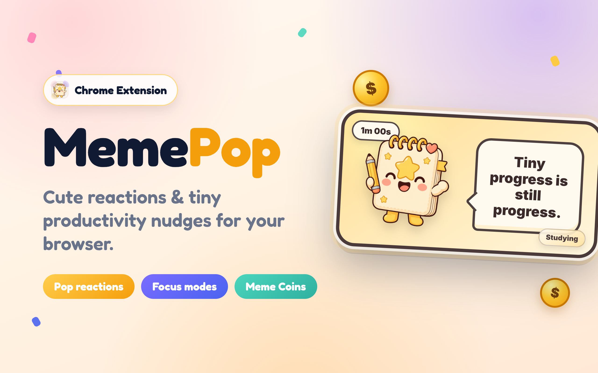

# MemePop

MemePop is a cute, privacy-friendly Manifest V3 Chrome extension that brings animated meme reactions, focus nudges, break reminders, streaks, and Meme Coins directly into your browser. It runs locally with no backend, no login, and no data collection.

## Demo

[](assets/demo/memepop-demo.mp4)

[Watch the demo video](assets/demo/memepop-demo.mp4)

## Features

- Centered MemePop popup with character art, speech bubble, timer, and controls.
- Side panel dashboard with settings, coins, streaks, help, and mode controls.
- Multi-mode timing with custom durations per mode.
- Focus Mode, Deadline Mode, Break Time, Hydration, Studying, Gaming, Office, Coding, Chill, Believe, and Party styles.
- Meme Coins, streaks, unlockable visual styles, and Meme Moment PNG creation.
- Local-only privacy model: no backend, no login, no data collection.

## Setup

```bash
npm install
npm run generate-assets
npm run build
```

## Load in Chrome

1. Open `chrome://extensions`.
2. Turn on Developer mode.
3. Click Load unpacked.
4. Select this folder: `/home/rowena001/Meme-Pop/meme-pop`.
5. Open a normal webpage and use the MemePop toolbar popup.

## Structure

- `manifest.json`: Chrome extension manifest.
- `shared.ts`: storage helper, default state, message database, timing rules, URL category detection.
- `background.ts`: focus alarms, notifications, coin cooldowns, settings/Meme Moment page opening.
- `content.ts` and `content.css`: draggable companion injected on webpages.
- `popup.html`, `popup.ts`, `popup.css`: main extension popup.
- `options.html`, `options.ts`, `options.css`: settings and privacy page.
- `moment.html`, `moment.ts`, `moment.css`: Meme Moment PNG creator.
- `assets/character/`: current transparent MemePop character placeholder.
- `assets/sounds/`: reserved for future custom sound files.

## Testing checklist

- Load the unpacked extension without manifest errors.
- Open a normal webpage and click Show MemePop Now.
- Set custom appearance and break minutes from 1 to 300, then confirm the countdown follows that break time.
- Add up to 10 target sites and confirm MemePop appears only on matching domains.
- Choose Assignment / Project Deadline Mode, add a project card, and confirm reminders, progress, focus start, overdue grouping, and completion coins work locally.
- Choose Exercise / Movement Break Mode and confirm the movement meme artwork and stretch messages appear.
- Drag MemePop and confirm the position is remembered after reload.
- Click MemePop and confirm the message changes.
- Confirm click coins have a cooldown.
- Unlock/select accessories and reload Chrome.
- Start and complete a focus session.
- Generate and download a Meme Moment PNG.
- Check the settings page privacy text.

## Placeholder assets

Run `npm run generate-assets` to regenerate placeholder icons, themed legacy meme panels, and the transparent MemePop character. Replace `assets/character/memepop.png` with final character art later, keeping the transparent PNG format.
